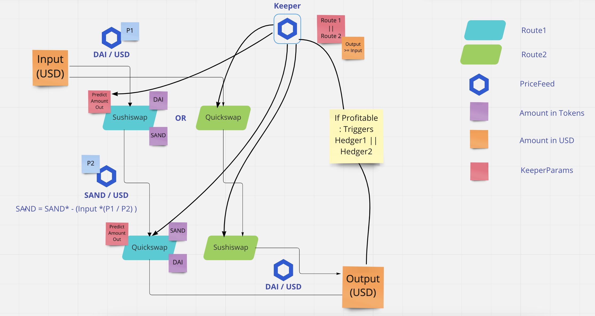

## Botminator 

🪢🪢 This is the official repository for Chainlink Hackathon with Encode Club 2022 🪢🪢

Botminator is a trading cross exchange bot arbitrage based on Proof Of Variation - using Chainlink PriceeFeed Oracle - and acting the Hedge with Chainlink Keepers. 

### Technical Paper 

### How it works 

- SAND : Output in token amount after swap.  
- SAND* : Input in token amount to swap in the 2nd swap of a route based on Input in USD to be profitable. 

 
### Inspiration 

To reduce the risk of having a sandwich attack AMM DEXs began offering Time Weighted Average Price (TWAP) oracles. TWAP is a pricing methodology that calculates the mean price of an asset during a specified period of time. For example, a “one-hour TWAP” means taking the average price over a defined hour of time. 

Cross-exchange market making :

- Less liquid market : make order 
- More Liquid market : taker order 

### Strategy 

It is important to choose the right dex or in other words the route to be profitable, and for this you have to : 

- Take into account the tax(fees) in the arbitrage while setting up orders. 
- Oracle exchange price feed choice : not necessarily the connected exchange <depends on strategy : more liquid exchange will give you more insight into the potential direction of token price> 

### Analysis Tools 

[Analysis tool for dexs](https://defillama.com/)

### Chainlink Integration 

- PriceFeed 
- Keepers 

### Advantages 

- Chainlink Keepers can execute a portion of the code deployed on-chain at a basic minimum web dev costs. 
- Distinct service that only compute code for that contract on-chain. 
- Save Ethereum fees. 
- Privacy 

### Future 

