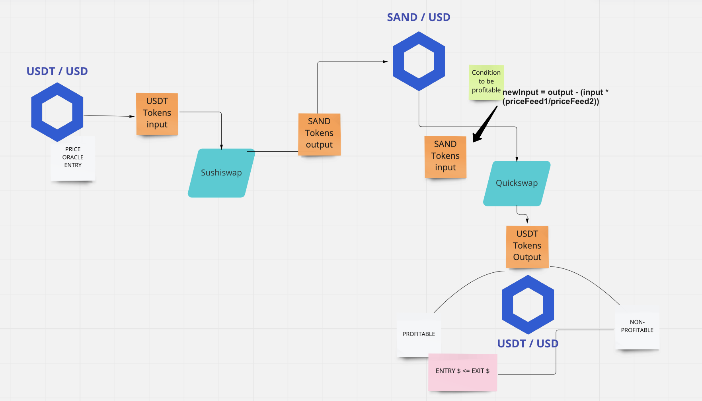

## BOTMINATOR 

🪢🪢 This is the official repository for Chainlink Hackathon with Encode Club 2022 🪢🪢

**REMINDER**  THIS IS NOT A FLASHSWAP BUT TRADING LOGIC BASED ON ORACLE PRICING -- YOU DO YOU, WE ARE NOT RESPONSIBLE FOR ANY LOSSES -- 


### Proof of Price Variation : PoPV

This is a trading bot doing swaps in Uniswap / Quickswap basing it's profitability on difference between the Price returned by the Oracle for the ```amountIn``` and the Price returned by the Oracle for the ```amountOut```.

The logic is the following, we are trading USDT for LINK then LINK for USDT :




   
  -  For this we are using ChainlinkOracle to query prices at many times of the process : 
 
 - So to be profitable you must have :  ``` amounts - x = (amountIn * priceFeed(USDT)) / (priceFeed(SAND)) ``` 
 
 --->  where [amounts - x]  is the number of SAND tokens minimum to swap to be profitable when using Quickswap after the first swap.
 
### Strategy : 

Cross-exchange market making :
- Less liquid market : make order 
- More Liquid market : taker order 


### Strategy to choose the "right" DEX : 

- Take into account the tax(fees) in the arbitrage while setting up orders. 
- Oracle exchange price feed choice : not necessarily the connected exchange <depends on strategy : more liquid exchange will give you more insight into the potential direction of token price> 

We have choose two dexes : Uniswap & QuickSwap :

The aim here is to create a bot arbitrage with swaps that can reduce the risk of having a sandwich attack to increase the profitability % with: 

- Uniswap V2-Core : adding Chainlink oracle PriceFeed to get prices before / after swap with Uniswap || QuickSwap. 


### Analysis Tools : 

[DeFi Tool](https://defillama.com/)


### CHAINLINK KEEPERS 

 Triggers automated trading strategy by :
 
- Managing [open-close] orders / computation using off-chain computation with Chainlink Keepers. 
- Adding gas price conditions to meet the checkUpkeep conditions to true only if gasLimit  is lower than x value 
- ...
- ...

### Why ?

- Chainlink Keepers can execute a portion of the code deployed on-chain at a basic minimum web dev costs. 
- Distinct service that only compute code for that contract on-chain. 
- Save Ethereum fees. 
- Privacy 

### Future : 


